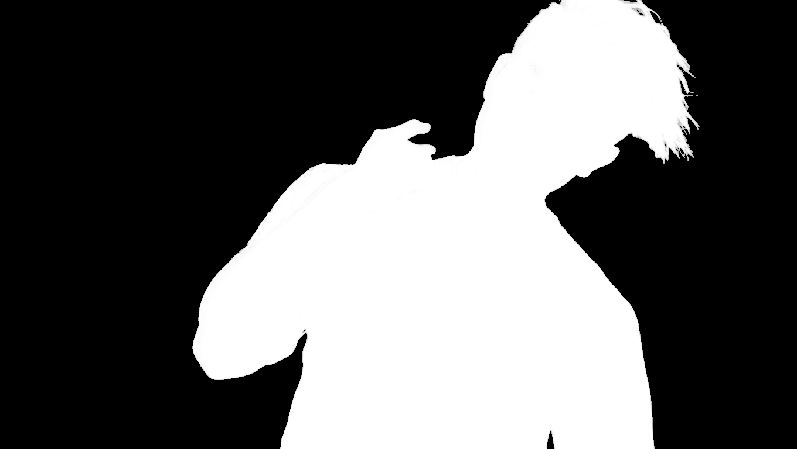

# Human Segmentation Dataset

[>>> Download Here <<<](https://drive.google.com/drive/folders/1K1lK6nSoaQ7PLta-bcfol3XSGZA1b9nt?usp=drive_link).

This dataset was created **for developing the best fully open-source background remover** of images with humans.
The dataset was crafted with [LayerDiffuse](https://github.com/layerdiffusion/LayerDiffuse), a Stable Diffusion extension for generating transparent images.

The dataset covers a diverse set of humans: various skin tones, clothes, hair styles etc.
Since Stable Diffusion is not perfect, the dataset contains images with flaws. Still the dataset is good enough for training background remover models.

The resulting model will be similar to [RMBG-1.4](https://huggingface.co/briaai/RMBG-1.4), but with open training data/process and commercially free to use.

The dataset contains transparent images of humans (`/humans`) which are randomly combined with backgrounds (`/backgrounds`). Then the ground truth (`/gt`) for segmentation was computed based on the transparent images. The results are written to a training and validation dataset.

I created more than 5.000 images with people and more than 5.000 diverse backgrounds.

# Create Training Dataset

The following script creates augmented training and validation data.

Notice: download the dataset from [Google Drive](https://drive.google.com/drive/folders/1K1lK6nSoaQ7PLta-bcfol3XSGZA1b9nt?usp=drive_link).

```
./create_dataset.sh
```

# Examples

Here you can see an augmented image and the resulting ground truth:




# Support

If you identify weaknesses in the data, please contact me.

I had some trouble with the Hugging Face file upload. You can find the data here: [Google Drive](https://drive.google.com/drive/folders/1K1lK6nSoaQ7PLta-bcfol3XSGZA1b9nt?usp=drive_link).

# Changelog

- Added more diverse backgrounds (natural landscapes, streets, houses)
- Added more close-up images
